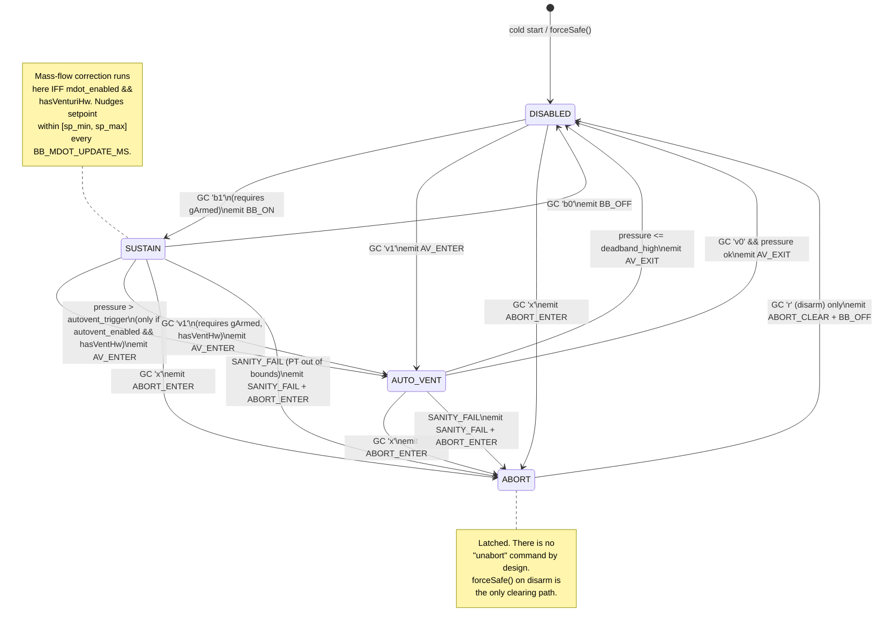
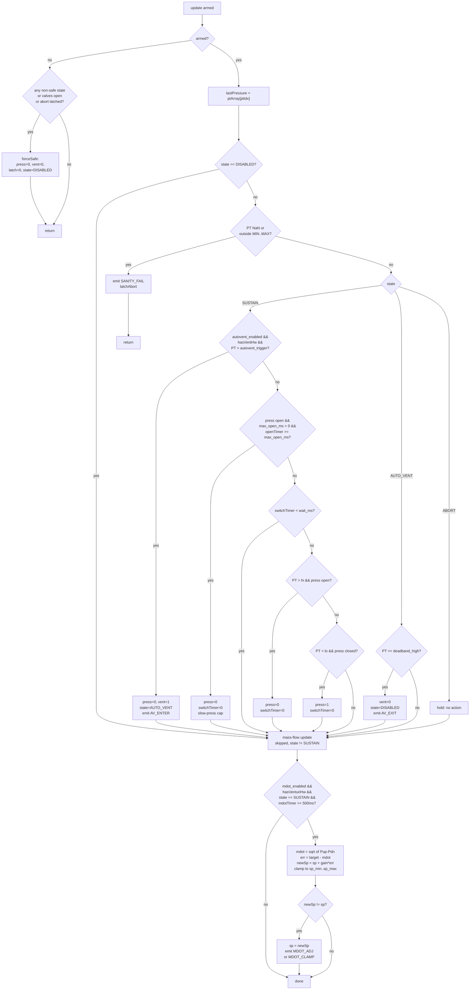

# Bang-Bang Control — End-to-End Auditable Flowchart

This document is the source of truth for what the V1 bang-bang controller does each tick. Every branch shown here is a line of code in `src/board-functions/BangBang.cpp`; every edge emits an `EVT:` to GC.

Read these three diagrams together:
1. **State machine** — what state the controller can be in, and what moves it between states.
2. **`update()` tick** — what happens on every call to `BBController::update(armed)`.
3. **Valve driver truth table** — mapping from state to the two solenoids.

---

## 1. State machine

---

## 2. `update(armed)` per-tick flow

---

## 3. Valve truth table

| State | Press solenoid | Vent solenoid | Notes |
|---|---|---|---|
| `DISABLED` | closed | closed | Safe default. Manual `S` commands permitted on non-BB channels. |
| `SUSTAIN` | toggled by bang-bang within `[sp − db/2, sp + db/2]` | closed | If `max_open_ms > 0`, press is force-closed after that many ms continuously open and held closed until `wait_ms` elapses. |
| `AUTO_VENT` | closed | open | Holds until `PT ≤ sp + db/2`, then drops to `DISABLED`. |
| `ABORT` | closed | open (if `hasVentHw`) | Latched. Only disarm clears. Without vent HW, press is still closed and `AV_NO_HW` is emitted. |

**Disarm (`r`) always wins.** It calls `forceSafe()` which unconditionally closes both valves, clears the ABORT latch, and moves to `DISABLED`, regardless of prior state.

---

## 4. Command → handler → state map

| GC command | Handler | Resulting call | Allowed from |
|---|---|---|---|
| `B<side><sp>,<db>,<wait>,<maxOpen>` | `handleB` | `configureCore()` + `bbSaveEeprom()` | Any state |
| `V<side><trig>,<autoOn>` | `handleV` | `configureVent()` + `bbSaveEeprom()` | Any state |
| `M<side><mdot>,<spMin>,<spMax>,<gain>,<on>` | `handleM` | `configureMdot()` + `bbSaveEeprom()` | Any state |
| `b<side>1` | `handleLowerB` | `enableSustain()` | `DISABLED` and `gArmed` |
| `b<side>0` | `handleLowerB` | `disableSustain()` | Any except `ABORT` |
| `v<side>1` | `handleLowerV` | `manualVent()` | Any except `ABORT`, requires `gArmed` + `hasVentHw` |
| `v<side>0` | `handleLowerV` | `manualVentClose(force=false)` | Only `AUTO_VENT`, requires pressure ≤ deadband-high |
| `x<side>` | `handleLowerX` | `latchAbort()` | Any state |
| `a` | inline | sets `gArmed = true` | Any state |
| `r` | inline | `forceSafe()` both sides | Any state |

---

## 5. Event emission — where each EVT is triggered

| `EVT` category | Emitted from | Condition |
|---|---|---|
| `CFG_PUSH` | `configureCore/Vent/Mdot` | Any successful config write (also during EEPROM load) |
| `BB_ON` | `_goto(SUSTAIN, …)` | `enableSustain()` success |
| `BB_OFF` | `_goto(DISABLED, …)` | `disableSustain()`, `AV_EXIT`, `forceSafe()` |
| `VALVE` | `_setPress`, `_setVent` | Every edge on either solenoid, with reason string |
| `AV_ENTER` | `_goto(AUTO_VENT, …)` | Manual `v…1` or auto-trigger |
| `AV_EXIT` | `manualVentClose`, `_updateAutoVent` | On close path; paired with `BB_OFF` |
| `AV_REJECT_CLOSE` | `manualVentClose` | Refused because pressure too high |
| `AV_NO_HW` | `manualVent`, `latchAbort` | Vent DC unset |
| `ABORT_ENTER` | `_goto(ABORT, …)` | `latchAbort()` or `SANITY_FAIL` |
| `ABORT_CLEAR` | `forceSafe` | Disarm clears a latched abort |
| `SANITY_FAIL` | `update` | PT NaN or outside `BB_PRESSURE_*_PSI` while non-`DISABLED` |
| `OWN_CONFLICT` | `enableSustain`, `disableSustain`, `manualVent` | Command rejected by state preconditions |
| `MDOT_ADJ` / `MDOT_CLAMP` | `_updateMdot` | Setpoint nudged / saturated at bound |

Every row of this table is a line of code. If you add a new state edge, you add a new row here.

---

## 6. What's intentionally out of scope (phase 2)

- **Venturi calibration.** `_computeMdot()` returns a proxy `sqrt(P_up − P_dn)` — it will trend correctly but is not a calibrated mass flow. Replace with full Bernoulli form once throat area / discharge coefficient / density are known.
- **Secondary-link staleness detector.** `v2PtData[]` is not timestamped. If the V2 crossover drops, BB keeps acting on stale data. Add a last-packet-millis watchdog before using this in anger.
- **AUTO_VENT → SUSTAIN auto-recovery.** Current behavior drops to `DISABLED` on `AV_EXIT` by design — requires explicit operator re-enable. Change only after an explicit ops decision.
